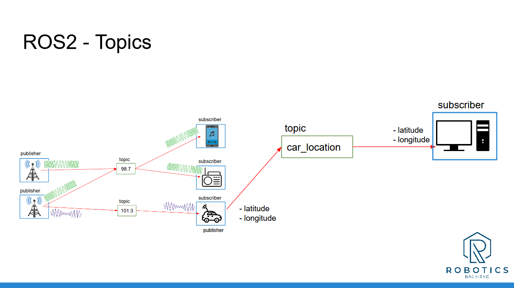
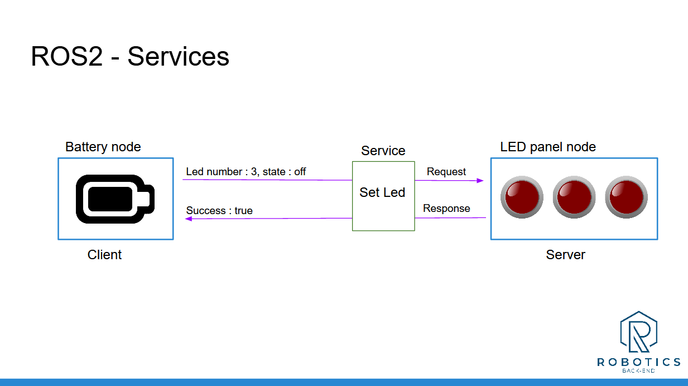

# Introduction

Notes from Udemy course **ROS2 For Beginner (ROS Jazzy)**


# Set-up environment

## Ubuntu MV on Mac

We are using [multipass](https://canonical.com/multipass) for spinning an Ubuntu VM (noble version)


```bash
$ multipass launch --cpus 2 --memory 2G --disk 32G --name ros2-vm noble
```

[Set up a graphical interface](https://documentation.ubuntu.com/multipass/en/latest/how-to-guides/customise-multipass/set-up-a-graphical-interface/) so that we can use Windows Remote Access to access to the GUI of Ubuntu VM (for graphical simulations).

## Install ROS2 (Jazzy)

Use [Jazzy installation guides](https://docs.ros.org/en/jazzy/Installation.html) to install ROS2 dev environment and tools.

# ROS2 Topics



# ROS2 Services - Client/Server Communication



## Introspect services with ros2 command line

launch a node with service
```bash
$ ros2 run my_cpp_pkg add_two_ints_server
```

```bash
$ ros2 node list
/add_two_ints_server
$ ros2 node info /add_two_ints_server
/add_two_ints_server
  Subscribers:
    /parameter_events: rcl_interfaces/msg/ParameterEvent
  Publishers:
    /parameter_events: rcl_interfaces/msg/ParameterEvent
    /rosout: rcl_interfaces/msg/Log
  Service Servers:
    /add_two_ints: example_interfaces/srv/AddTwoInts
    /add_two_ints_server/describe_parameters: rcl_interfaces/srv/DescribeParameters
    /add_two_ints_server/get_parameter_types: rcl_interfaces/srv/GetParameterTypes
    /add_two_ints_server/get_parameters: rcl_interfaces/srv/GetParameters
    /add_two_ints_server/get_type_description: type_description_interfaces/srv/GetTypeDescription
    /add_two_ints_server/list_parameters: rcl_interfaces/srv/ListParameters
    /add_two_ints_server/set_parameters: rcl_interfaces/srv/SetParameters
    /add_two_ints_server/set_parameters_atomically: rcl_interfaces/srv/SetParametersAtomically
  Service Clients:

  Action Servers:

  Action Clients:

$ ros2 service list
/add_two_ints
/add_two_ints_server/describe_parameters
/add_two_ints_server/get_parameter_types
/add_two_ints_server/get_parameters
/add_two_ints_server/get_type_description
/add_two_ints_server/list_parameters
/add_two_ints_server/set_parameters
/add_two_ints_server/set_parameters_atomically

$ ros2 service type /add_two_ints
example_interfaces/srv/AddTwoInts

$ ros2 interface show example_interfaces/srv/AddTwoInts
int64 a
int64 b
---
int64 sum

$ ros2 service call /add_two_ints example_interfaces/srv/AddTwoInts "{a: 2, b: 5}"
requester: making request: example_interfaces.srv.AddTwoInts_Request(a=2, b=5)

response:
example_interfaces.srv.AddTwoInts_Response(sum=7)
```

## Remap a service at runtime

```bash
$ ros2 run my_cpp_pkg add_two_ints_server --ros-args -r add_two_ints:=abc
[INFO] [1750653496.055702929] [add_two_ints_server]: Add Two Ints server has started
```

```bash
$ ros2 service list
/abc

$ ros2 service call /abc example_interfaces/srv/AddTwoInts "{a: 2, b: 5}"
requester: making request: example_interfaces.srv.AddTwoInts_Request(a=2, b=5)

response:
example_interfaces.srv.AddTwoInts_Response(sum=7)

$ ros2 run my_py_pkg add_two_ints_client --ros-args -r add_two_ints:=abc
[INFO] [1750653636.058925815] [add_two_ints_client]: Received: 11
```

# ROS2 Interfaces - Msg/Srv interfaces

[ROS2 Create Custom Message (Msg/Srv)](https://roboticsbackend.com/ros2-create-custom-message/)

